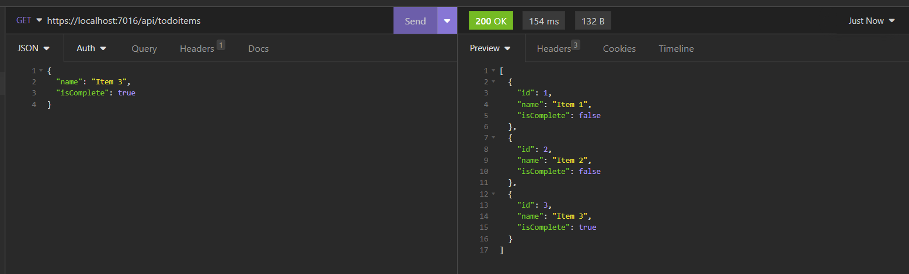

  # To Do List API
  
  This application uses C# and .NET Core to host a simple to do list api.
  
  ## Table of Contents
  
  * [Installation](#installation)
  * [Built With](#built)
  * [Usage Information](#usage)
  * [Authors & Acknowledgements](#credits)
  * [Contact](#questions)
  
  ## Installation 
  After cloning the repository, run the application using Visual Studio. Use Insomnia or a comparable application to complete CRUD operations.
  
  ## Built With 
  * Visual Studio
  * .NET Core
  * Entity Framework Core

  ## Usage Information
  This is a practice application only. 
    
  
  ## Authors & Acknowledgements
  Built following [this](https://learn.microsoft.com/en-us/aspnet/core/tutorials/first-web-api?view=aspnetcore-6.0&tabs=visual-studio) tutorial.
  
  Made by [TOVTC](https://github.com/TOVTC).
  
  ## Questions?
  Contact repository author via [GitHub](https://github.com/TOVTC). 
    
  
  